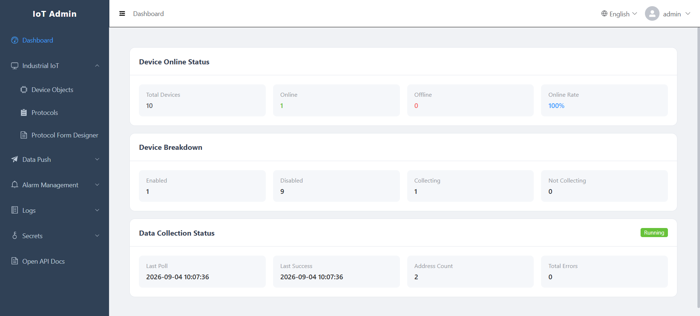

# iot-gateway · Industrial IoT Data Gateway

English | [简体中文](README.md)

**iot-gateway** is a ready-to-run industrial IoT data acquisition gateway: it polls PLCs and industrial devices on a schedule, pushes collected data to downstream channels such as MQTT, TDEngine and InfluxDB, and ships with an embedded web admin console. The whole system is deployed to gateways or industrial PCs as a **single binary** — no external database required.

<!-- Admin console screenshot (dashboard / device management): place EN-locale screenshots under docs/images/ -->



## Features

- **Multi-protocol acquisition**: 12 built-in protocol/transport drivers covering Modbus, Siemens S7, Mitsubishi MC, Omron FINS/CIP, Rockwell CIP and OPC UA — with batch register reads and configurable byte/word order.
- **Dynamic form driven**: protocol parameters are stored in the database as dynamic form schemas (JSON), so new protocols require no frontend changes.
- **Acquisition engine**: worker-pool scheduled polling tasks; a background watcher detects configuration changes and applies **zero-downtime hot reload**.
- **Push engine**: device-grouped batch dispatch; channel configs hot-reload; on network outage data lands in a **persistent local outbox** and is automatically re-sent once the connection recovers — no data loss.
- **Disconnection alarms**: automatic detection of device poll failures and channel disconnections (debounce + state machine), recorded on offline/recovery edges, queryable in a unified alarm center.
- **Web admin console**: dashboard, device objects, address tags, protocol management, channel management, alarms, log viewer and API key management — bilingual (EN/中文) UI.
- **Open API**: read-only `/openApi/*` endpoints authenticated by an `X-Api-Key` header, for MES / ERP and other external systems.
- **Single-binary deployment**: frontend embedded via `go:embed`, SQLite implemented in pure Go (CGO-free). One executable is the whole system; can be registered as a Windows service or Linux systemd service with auto-start and crash restart.

## Architecture

```
              ┌─────────────────── single iot-gateway binary ───────────────────┐
              │                                                                 │
  PLC / device ──▶ collector engine ──▶ driver layer                            │
              │   (worker pool /      (Modbus/S7/MC/FINS/CIP/OPC UA ...)        │
              │    hot reload)                                                  │
              │      │                                                          │
              │      ▼ RecordSink                                               │
              │  push engine ──────┬──▶ MQTT broker                             │
              │   (channel hot     ├──▶ TDEngine v3                             │
              │    reload)         └──▶ InfluxDB v3                             │
              │      │ offline                                                  │
              │      ▼                                                          │
              │  SQLite outbox local buffer (replay on recovery)                │
              │                                                                 │
              │  disconnection alarms · web console (/admin) · Open API         │
              └─────────────────────────────────────────────────────────────────┘
```

## Supported Protocols

| Protocol | Transport | Typical devices |
|---|---|---|
| ModBus.RTU / ModBus.TCP | Serial / Ethernet | Modbus-capable PLCs, meters, VFDs |
| Siemens.S7 | Ethernet | Siemens S7 series PLCs |
| Mitsubishi.MC.TCP / MC.Serial | Ethernet / Serial | Mitsubishi MC-protocol PLCs |
| Omron.FINS.UDP / FINS.TCP / FINS.Serial / FINS.HostLinkTCP | UDP / TCP / Serial | Omron FINS-protocol PLCs |
| Omron.CIP | EtherNet/IP | Omron CIP devices |
| Rockwell.CIP | EtherNet/IP | Rockwell (Allen-Bradley) ControlLogix / CompactLogix |
| OPC.UA | Ethernet | OPC UA capable devices and gateways |

> For measured per-protocol capacity (devices × points) and tuning advice, see the [capacity load-test report](backend/cmd/loadtest/README.en.md).

## Supported Push Channels

| Channel | Notes |
|---|---|
| `mqtt` | Eclipse Paho MQTT client — QoS, TLS, last-will, etc. |
| `tdengine-v3` | TDEngine 3.x via the official driver-go WebSocket driver (CGO-free, connects through taosAdapter) |
| `influxdb-v3` | InfluxDB 3.x via a self-built Line-Protocol-over-HTTP client (no heavy official SDK) |


## Quick Start

### Prerequisites

- Go ≥ 1.26 and Node.js ≥ 22 (only needed for development/building; running in production needs only the binary)

### 1. Development mode (split frontend/backend, hot reload)

```bash
# Terminal 1: backend (port 9081)
cd backend && go run .

# Terminal 2: frontend (port 4000)
cd frontend && npm install && npm run dev
```

Or from VS Code: Terminal → Run Task → `dev` to start both in parallel.
Open `http://localhost:4000` — requests are proxied by Vite to the backend on 9081.

### 2. Production build (single binary)

```bash
./build.sh            # Linux/macOS: builds Linux + Windows artifacts (default)
./build.sh windows    # Windows only    ./build.sh linux    # Linux only    ./build.sh native    # current platform

build.bat             # Same on Windows (build.bat windows for Windows-only)
```

The artifact is `backend/iot-gateway(.exe)` (frontend embedded). Copy it to the target device and run:

```bash
./iot-gateway        # Admin console: http://<host-ip>:9081/admin
```

### 3. Service deployment (auto-start on boot)

| Platform | Install | Uninstall |
|---|---|---|
| Windows | Run `install.bat` as administrator | Run `uninstall.bat [--purge]` as administrator |
| Linux | `sudo ./install.sh` | `sudo ./uninstall.sh [--purge]` |

- On Windows the service is registered via `sc` (native Windows service support is built in — no NSSM or other third-party tools), with automatic restart on crash.
- Default install dirs: Windows `%ProgramFiles%\iot-gateway`, Linux `/opt/iot-gateway` (override with `IOT_GATEWAY_HOME` / `INSTALL_DIR`).
- The service runs with the install directory as working directory; `data/` (SQLite) and `log/` (logs) are written there. `--purge` also deletes data on uninstall; by default data is preserved.

### 4. Docker Compose deployment (containerized)

No local Go / Node.js installation required. Run from the project root (multi-stage build: frontend build → Go compile → runtime image):

```bash
docker compose up -d --build    # Build the image and start in the background
docker compose logs -f          # Follow logs
docker compose ps               # Check status (incl. health check)
docker compose down             # Stop and remove the container
```

- Admin console: `http://<host-ip>:9081/admin` (host port `9081`).
- `./data` (SQLite) and `./log` (logs) are mounted into the container at `/app/data` and `/app/log` — data survives container rebuilds.
- A built-in health check (`/health`) plus `restart: unless-stopped` restarts the container automatically on failure.

### Default accounts

Two accounts are seeded on first start: `admin` and `hand`, both with the initial password `hand@123`.

> ⚠️ **Security notice**: the default password is for first login only — **change all default account passwords immediately** in production. Avoid exposing the admin console (`/admin`) directly to the public internet. See [SECURITY.md](SECURITY.md) for further hardening (JWT secret configuration, network isolation, etc.).

## Admin Console

| Page | Description |
|---|---|
| Dashboard | Device online status, acquisition and push overview |
| Device Objects / Address Tags | Manage devices grouped by gateway; maintain collection points and data types |
| Protocol Management | Dynamic-form protocol parameter configuration (custom form JSON supported) |
| Channel Management | MQTT / TDEngine / InfluxDB channel configuration and status monitoring |
| Alarm Management | Device and channel disconnection alarms with history query |
| Log Viewer | Browse and download gateway runtime logs online |
| API Keys | Create / enable / disable Open API keys (admin) |

## Open API

External systems call these endpoints with a key created under "API Keys" in the console, carried in the `X-Api-Key` header:

```
GET /openApi/device/page          # Paged device query
GET /openApi/deviceAddress/page   # Paged device address query (by device ID)
```

## Push Payload Format

The field semantics of each pushed point record (`value`, `kind`, `quality`, etc.) and the self-describing parsing conventions for MQTT / TDEngine / InfluxDB are documented in the [push payload contract](backend/specs/push-payload.en.md). Downstream consumers (MES / TSDB analytics) should parse according to it rather than gateway internals.

## Configuration

Configuration lives in `backend/default.yaml`; `APP_ENV=dev|prod` switches to `dev.yaml` / `prod.yaml` overrides. Key options:

```yaml
server:
  port: 9081          # HTTP service port
jwt:
  secret: ""          # JWT signing secret: if empty, a random ephemeral secret is
                      # generated per start (sessions don't survive restarts). In
                      # production set a fixed one, preferably via the
                      # IOT_GATEWAY_JWT_SECRET environment variable.
  expireHour: 24      # Login token validity
log:
  level: INFO         # Log level
  maxSizeMB: 10       # Log rotation size
  maxDays: 30         # Log retention days
sqlite:
  path: data/iot-gateway.db   # SQLite data file path
```

## Project Layout

```
├── backend/            # Go backend
│   ├── collector/      # Acquisition engine (poll scheduling / config hot reload)
│   ├── driver/         # Protocol driver registry (modbus/s7/mitsubishi/omron/rockwell/opcua)
│   ├── push/           # Push engine (mqtt/tdengine-v3/influxdb-v3 + outbox)
│   ├── controller/ service/ model/  # HTTP layers (Controller → Service → Database)
│   ├── database/sqlite/migrations/  # SQLite migration scripts
│   ├── router/ middleware/          # Routing and middleware (JWT / Open API key / CORS)
│   ├── web/            # Frontend build artifacts (embedded via go:embed)
│   └── specs/          # Engineering specification documents
├── frontend/           # Vue3 admin frontend (Element Plus + Pinia + vue-i18n)
├── docker-compose.yml  # Docker Compose deployment orchestration (multi-stage build with backend/Dockerfile)
├── build.bat / .sh     # One-click build (frontend build → embed → Go cross compile)
├── install.bat / .sh   # Service installation (Windows / Linux)
└── uninstall.bat / .sh # Service uninstallation
```

## Tech Stack

| Layer | Choice |
|---|---|
| Backend | Go 1.26 + Gin + GORM + Google Wire + Viper + JWT |
| Storage | SQLite (pure Go implementation, CGO-free) |
| Protocol libs | goburrow/modbus · robinson/gos7 · gopcua/opcua (other protocols self-implemented) |
| Frontend | Vue 3 + Vite + Element Plus + Pinia + Tailwind CSS 4 + vue-i18n |
| Deployment | go:embed single binary · Windows service / Linux systemd |

## Contributing

Bug reports, documentation, new protocol drivers and push channels are all welcome — see [CONTRIBUTING.md](CONTRIBUTING.md). Please do not open public issues for security vulnerabilities; see [SECURITY.md](SECURITY.md) instead.

## Community

- **Issues / Discussions**: file bugs and feature requests on [GitHub Issues](https://github.com/wang4856304/iot-gateway/issues) (the Gitee repo is primary for Chinese users; both are monitored).
- **Email**: open-source inquiries and commercial licensing at `15289288565@163.com`.

## License

This project is open-sourced under the [GNU AGPL-3.0](LICENSE).

- If you modify this project and offer it as a network service (including deploying it for third parties), you must release the corresponding source code under AGPL-3.0.
- For **closed-source commercial use, OEM embedding, or commercial deployments where you prefer not to disclose source**, contact us to purchase a commercial license (exempting you from AGPL obligations).
- External contributions are licensed to the maintainer under [CLA.md](CLA.md) and released with the project under AGPL-3.0; the commercial-edition repository stays separate from this one.

For open-source inquiries and commercial licensing, contact: `<15289288565@163.com>`
